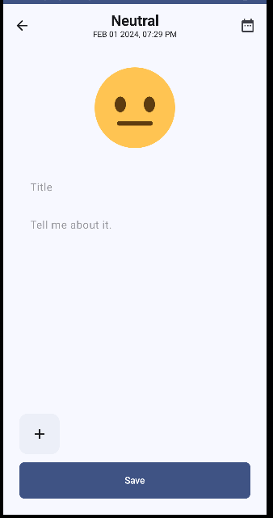

# My Diary App: An Android multi-modular application with Compose

## Project Overview
This application builds a diary Android application with Jetpack Compose, Room, MongoDB, and Firebase. 

## Technologies
- Jetpack Compose: build UI of the application
- Firebase: store users' uploaded photos
- Room library: in case photos are not uploaded successfully, store users' uploaded photos to local database 
- MongoDB: store users' information including diary information

## Features

### User Authentication
Users are required to create an account and sign in in order to access the app. Users can use one-swipe social signin with Google.

### Diary Listings
After authentication, users can view a list of diaries they have created grouped by dates. Diary information includes dates and time created, titles and contents, images, and mood icons. 

### Create/Update Diary
Users can create/update diaries, modify dates and time, and upload/delete pictures. 

 

### Account Overview
Users can delete all previous diaries. 

